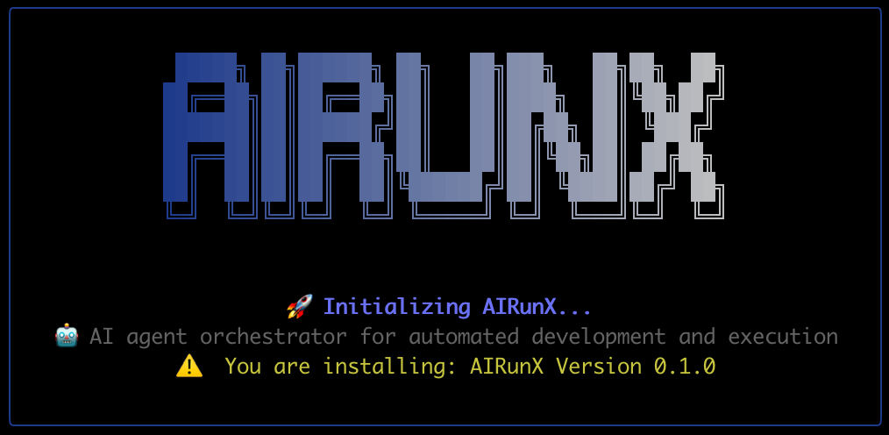

# AIRunX

> Vendor-neutral Agent Orchestrator for developer workflows with LangGraph, AGENTS.md, and multi-agent pipelines

[](LICENSE)
[](https://nodejs.org)
[](https://github.com/digitalpyro/airunx/actions/workflows/ci.yml)
[](https://www.npmjs.com/package/airunx)
[](https://github.com/digitalpyro/airunx)

## Overview

AIRunX is a thin, powerful CLI tool that orchestrates multi-agent development workflows. It executes end-to-end development tasks from GitHub issues, PRDs, or developer prompts using intelligent agent pipelines.

<p align="center">
  
</p>

### Key Features

- 🤖 **Autonomous Pipelines**: 4 execution pipelines with clear deliverables → Pull request
- 🔧 **Execution Pipelines**: thin, standard, feature, mission-critical
- 💓 **Heartbeat Mode**: Continuous agent that polls GitHub Issues as a task queue
- 🌳 **Git Worktrees**: Spawn parallel PRs from a single machine
- 📊 **Dashboard**: Real-time status, runtime, tokens used, heartbeat
- 🔌 **Vendor-Neutral**: Works with Claude Code, Codex, Cursor
- 💰 **Execution Fidelity**: Balance quality vs. cost with 4 fidelity levels (fast, standard, thorough, ultra)

## Table of Contents

- [Installation](#installation)
- [Quick Start](#quick-start)
- [CLI Reference](#cli-reference)
- [Pipelines](#pipelines)
- [Heartbeat Execution Mode](#heartbeat-execution-mode)
- [Compound Engineering](#compound-engineering)
- [Architecture](#architecture)
- [Execution Fidelity](#execution-fidelity)
- [Approval Modes](#approval-modes)
- [PR Customization](#pr-customization)
- [Multi-Provider Architecture](#multi-provider-architecture)
- [Runtime Configuration Flags](#runtime-configuration-flags)
- [Configuration](#configuration)
- [Development](#development)
- [MCP Integration](#mcp-integration)
- [Troubleshooting](#troubleshooting)
- [Contributing](#contributing)

## Installation

```bash
npm install -g airunx
```

Or clone and install locally:

```bash
git clone https://github.com/digitalpyro/airunx.git
cd airunx
npm install
npm run build
npm link
```

## Quick Start

### Prerequisites

Install at least one CLI provider:

**Option A: Claude Code (Recommended)**

```bash
npm install -g @anthropic-ai/claude-code
```

Authentication options:

- **Subscription**: `claude login` (uses your Claude Pro/Team quota)
- **API Key**: `export ANTHROPIC_API_KEY=sk-ant-...` (pay-per-token)

**Option B: OpenAI Codex**

```bash
npm install -g @openai/codex
```

Authentication options:

- **Subscription**: `codex login` (uses your ChatGPT Plus/Team quota)
- **API Key**: `export OPENAI_API_KEY=sk-...` (pay-per-token)

**Option C: Cursor CLI (experimental — least tested backend)**

```bash
curl https://cursor.com/install -fsS | bash
```

Authentication options:

- **Subscription**: `cursor-agent login` (uses your Cursor plan quota)
- **API Key**: `export CURSOR_API_KEY=...` (pay-per-token)

> **Billing Note**: Subscription auth uses your existing plan quota. API keys use pay-per-token billing to your respective API account.

**GitHub Access (required for heartbeat mode and issue-based workflows):**

_Option A: gh CLI (recommended for local development)_

```bash
brew install gh      # macOS
# or: sudo apt install gh  # Debian/Ubuntu
gh auth login
```

_Option B: Token only (recommended for servers/CI — no gh CLI needed)_

```bash
export GITHUB_TOKEN=ghp_...
# or load via --dotenv flag:
airunx heartbeat start --dotenv /path/.env --repo owner/repo
```

When `gh` CLI is not installed, AIRunX automatically falls back to the GitHub REST API using `GITHUB_TOKEN` or `GH_TOKEN`. All heartbeat operations (polling, labels, comments, issue assignment) work in token-only mode.

**Token Permissions:**

| Token Type             | Required Scopes                               |
| ---------------------- | --------------------------------------------- |
| **Classic token**      | `repo` (full control of private repositories) |
| **Fine-grained token** | See permissions table below                   |

Fine-grained personal access token permissions (set per-repository or organization):

| Permission        | Access Level   | Used For                                                 |
| ----------------- | -------------- | -------------------------------------------------------- |
| **Issues**        | Read and write | Poll tasks, assign/unassign, update labels, close issues |
| **Pull requests** | Read and write | Create PRs, add labels, update descriptions              |
| **Contents**      | Read and write | Clone repos, push branches, read files                   |
| **Metadata**      | Read-only      | Repository info (granted automatically)                  |

> **Note:** `GH_TOKEN` takes precedence over `GITHUB_TOKEN`, matching `gh` CLI behavior. For heartbeat server deployments, a fine-grained token scoped to specific repositories is recommended over a classic token for security.

### Setup

1. **Initialize your project**:

```bash
airunx init

# If using API key auth (not subscription), load your .env first:
airunx init --dotenv .env
```

This will:

- Detect available backends
- Let you choose a default backend
- Create `.airunx/settings.json` with configuration pointers
- Create `.airunx/config.yml` with your backend configuration
- Optionally create local `AGENTS.md` and `pipelines.yaml` for customization

2. **Check system health**:

```bash
airunx doctor
```

3. **Configure GitHub authentication**:

**Option 1: GitHub CLI (recommended for local development)**

```bash
gh auth login
```

**Option 2: Environment Variable (recommended for CI/CD and servers)**

```bash
export GITHUB_TOKEN=ghp_your_token_here
```

Required scopes: `repo`, `read:org`
Create a token at: https://github.com/settings/tokens/new?scopes=repo,read:org

When both are configured, `GITHUB_TOKEN` takes precedence.

4. **Configure other credentials** (if needed):

```bash
cp .env.example .env
# Edit .env with your API keys
```

5. **Run a workflow**:

```bash
# From GitHub issue
airunx run https://github.com/user/repo/issues/123

# From PRD file
airunx run --prd ./specs/feature.md

# From prompt
airunx run "Add user authentication with JWT"

# With fidelity control (quality vs. cost)
airunx run --fidelity fast "Quick README update"
airunx run --fidelity ultra "Critical security patch"

# With runtime configuration flags
airunx run --prd ./specs/feature.md                    # External PRD file
airunx run --prd https://example.com/prd.md            # Remote PRD URL
airunx run --project ~/projects/new-app "Add auth"     # Target different project
airunx run --context ./extra-context.md "Add feature"  # Additional context

# Combine flags
airunx run --prd ./prd.md --project ~/projects/app --context ./design-context.md
```

6. **Check status**:

```bash
airunx status
```

### Server Deployment

For server/production deployments without interactive setup:

1. **Create settings file:**

```bash
mkdir -p ~/.airunx
cat > ~/.airunx/settings.json << 'EOF'
{
  "workspace_location": "/opt/airunx/repos",
  "env_file_location": "/etc/airunx/.env",
  "default_backend": "claude-code"
}
EOF
```

2. **Create env file:**

```bash
sudo mkdir -p /etc/airunx
sudo cat > /etc/airunx/.env << 'EOF'
GITHUB_TOKEN=ghp_your_production_token
ANTHROPIC_API_KEY=sk-ant-your_production_key
EOF
sudo chmod 600 /etc/airunx/.env
```

3. **Run with GitHub issue URL:**

```bash
airunx run https://github.com/owner/repo/issues/123
# Repo will be auto-cloned to /opt/airunx/repos/owner/repo
```

No `airunx init` required - just copy settings into place.

4. **Run heartbeat mode:**

```bash
airunx heartbeat start --repo owner/repo
# Repos auto-clone when processing issues
```

5. **Clean up stale repos:**

```bash
airunx cleanup workspace --older-than 30 --dry-run
airunx cleanup workspace --older-than 30
```

## CLI Reference

### Global Options

```bash
airunx --version    # Show version number
airunx --help       # Show help
airunx --debug      # Enable debug output (secrets are redacted)
airunx --quiet      # Suppress non-essential output (errors always shown)
```

`--debug` and `--quiet` are mutually exclusive and available on all subcommands.

### Commands

#### `airunx run`

Execute an orchestrated workflow from a GitHub issue, PRD, or prompt.

```bash
airunx run [input] [options]
```

**Arguments:**
| Argument | Description |
|----------|-------------|
| `input` | GitHub issue URL, file path, or inline prompt (optional if `--prd` provided) |

**Options:**
| Option | Description | Default |
|--------|-------------|---------|
| `-m, --mode <mode>` | Orchestration mode: `pipeline`, `raw` | `pipeline` |
| `-w, --worktree <name>` | Git worktree name | Auto-generated |
| `-b, --base-branch <branch>` | Base branch for worktree | Auto-detected |
| `-f, --fidelity <level>` | Execution fidelity: `fast`, `standard`, `thorough`, `ultra` | `standard` |
| `-p, --pipeline <name>` | Pipeline to use from pipelines.yaml | `standard` |
| `--project <path>` | Target project directory (or project name from `folders`) | Auto-detected |
| `--prd <path>` | Path or URL to PRD file | - |
| `--context <path>` | Path to additional context file | - |
| `--backend <backend>` | Override configured backend: `claude-code`, `cursor`, `codex` | From config |
| `--format <format>` | Output format: `human`, `json` | `human` |
| `--no-dashboard` | Disable dashboard output | - |
| `--skip-version-check` | Skip checking if AIRunX is up-to-date with remote | - |
| `--keep-worktree` | Keep the worktree after execution (do not clean up) | - |
| `--no-sync` | Skip syncing source branch with remote before worktree creation | - |
| `--from-branch <branch>` | Use specified branch as the source for the new worktree, overriding the default base branch | - |
| `--workspace <path>` | Directory for cloning repos (server deployments) | `~/.airunx/repos` |
| `--dotenv <path>` | Path to .env file for environment variables | Auto-detected |
| `--no-pr` | Skip PR creation even on successful completion | `false` |
| `-v, --verbose` | Show detailed execution progress (stages, timing, spawn counts) | `false` |
| `--ci-verification-gate` | After PR creation, poll GitHub Actions and iterate on CI failures (up to 3 attempts). Overrides `ci_verification_gate` setting | `false` |

**Examples:**

```bash
# From GitHub issue
airunx run https://github.com/user/repo/issues/123

# From PRD file
airunx run --prd ./specs/feature.md

# With fidelity control
airunx run --fidelity ultra "Critical security patch"

# Skip version check for faster startup
airunx run --skip-version-check "Quick fix"

# Keep worktree after execution for investigation
airunx run --keep-worktree "Debug this issue"

# Skip syncing with remote (offline work or when local is current)
airunx run --no-sync "Quick local test"

# Work from a feature branch instead of main
airunx run --from-branch feature/api-v2 "Add new endpoint"

# Combine: use feature branch without syncing
airunx run --from-branch feature/wip --no-sync "Continue work"

# Full example with multiple options
airunx run --prd ./prd.md --project ~/projects/app --fidelity thorough --skip-version-check
```

#### `airunx init`

Initialize a project with AIRunX configuration.

```bash
airunx init [options]
```

**Options:**
| Option | Description |
|--------|-------------|
| `-f, --force` | Overwrite existing configuration files |
| `-r, --reset` | Clear cache and state files before initialization |
| `--workspace <path>` | Set workspace location for cloning repos (server deployments) |
| `--from-workspace <path>` | Import folders from VSCode .code-workspace file |
| `--dotenv <path>` | Load environment file before backend detection (for API key auth) |

**What it does:**

- Detects available backends (Claude Code, Cursor, Codex)
- Creates `.airunx/settings.json` with configuration pointers
- Creates `.airunx/config.yml` with backend configuration
- Optionally creates local `AGENTS.md` and `pipelines.yaml` for customization

#### `airunx status`

Show status of running workflows.

```bash
airunx status [options]
```

**Options:**
| Option | Description |
|--------|-------------|
| `-a, --all` | Show all workflows including completed |

#### `airunx doctor`

Check backend availability and system configuration.

```bash
airunx doctor
```

**What it checks:**

- Node.js version (>= 18.0.0 required)
- Environment variables
- Backend availability (Claude Code, Cursor, Codex)
- GitHub CLI authentication
- Git repository and main branch
- System configuration validity
- Pipeline configuration
- Fidelity cost estimates

#### `airunx circuit`

Manage circuit breaker state for backends. The circuit breaker prevents repeated calls to failing backends.

```bash
airunx circuit [command]
```

**Subcommands:**
| Command | Description |
|---------|-------------|
| `status` | Show circuit breaker status for all backends (default) |
| `reset <backend>` | Reset circuit breaker for a specific backend |

**Examples:**

```bash
# View circuit breaker status
airunx circuit
airunx circuit status

# Reset a tripped circuit breaker
airunx circuit reset claude-code
```

#### `airunx cleanup`

Clean up AIRunX resources including worktrees, debug files, and state.

```bash
airunx cleanup [command] [options]
```

**Subcommands:**
| Command | Description |
|---------|-------------|
| `run` | Run cleanup of AIRunX resources (default) |
| `list` | List debug files |
| `workspace` | Clean up cloned repos in workspace directory |

**Options for `cleanup run`:**
| Option | Description |
|--------|-------------|
| `--worktrees` | Clean up orphan worktrees |
| `--debug-files [days]` | Clean up debug files older than N days (default: 7) |
| `--workflow-state` | Clean up workflow state files |
| `--todos` | Clean up todo files |
| `--all` | Clean up all resource types |
| `-f, --force` | Force cleanup even with uncommitted changes |
| `--workflow-id <id>` | Clean up specific workflow by ID |
| `--project <path>` | Target project directory for cleanup |
| `--dry-run` | Preview what would be cleaned without making changes |

**Examples:**

```bash
# Clean up all resources
airunx cleanup --all

# Clean up only old debug files
airunx cleanup --debug-files 14

# Preview cleanup without making changes
airunx cleanup --all --dry-run

# Force cleanup of orphan worktrees
airunx cleanup --worktrees --force

# List debug files
airunx cleanup list
```

#### `airunx validate`

Validate configuration files against their schemas.

```bash
airunx validate [files...] [options]
```

**Arguments:**
| Argument | Description |
|----------|-------------|
| `files` | Specific files to validate (optional, validates all if omitted) |

**Options:**
| Option | Description |
|--------|-------------|
| `-l, --lenient` | Use lenient mode (warnings instead of errors) |
| `-j, --json` | Output results in JSON format (for CI/CD) |
| `-a, --all` | Validate all project configuration files |
| `-g, --global` | Include global configuration files |
| `-t, --type <type>` | Force file type: `settings`, `pipelines`, `agents`, `system-config` |
| `--schema` | Show schema documentation for config files |

**Examples:**

```bash
# Validate all project config files
airunx validate --all

# Validate specific file
airunx validate .airunx/settings.json

# Validate with lenient mode (warnings instead of errors)
airunx validate --lenient .airunx/pipelines.yaml

# JSON output for CI/CD integration
airunx validate --all --json

# Include global config files
airunx validate --all --global

# Show schema documentation
airunx validate --schema
airunx validate --schema --type pipelines
```

**What it validates:**

- `settings.json` - Configuration pointers and settings
- `pipelines.yaml` - Pipeline definitions with agent roles
- `AGENTS.md` - Agent role definitions (markdown format)
- `config.yml` - System configuration with backend routing

**Validation modes:**

- **Strict** (default): Errors cause validation to fail
- **Lenient** (`--lenient`): Invalid enum values become warnings with suggestions

#### `airunx agents-validate`

Interactive AGENTS.md validation with model checking and typo suggestions.

```bash
airunx agents-validate [path] [options]
```

**Arguments:**
| Argument | Description |
|----------|-------------|
| `path` | Path to AGENTS.md file (optional, auto-detected) |

**Options:**
| Option | Description |
|--------|-------------|
| `--fix` | Automatically apply suggested fixes |
| `--non-interactive` | Run without prompts (for CI/CD) |
| `--no-cost-warnings` | Disable cost warnings for expensive models |
| `-l, --lenient` | Use lenient mode (warnings instead of errors) |
| `-j, --json` | Output results in JSON format |

**Examples:**

```bash
# Validate auto-detected AGENTS.md
airunx agents-validate

# Validate specific file
airunx agents-validate ./custom/AGENTS.md

# Auto-fix typos in model names
airunx agents-validate --fix

# CI/CD mode with JSON output
airunx agents-validate --non-interactive --json
```

**What it validates:**

- Agent role names (with typo suggestions)
- Provider field values (`claude-code`, `cursor`, `codex`)
- **Model field values** (`opus`, `sonnet`, `haiku`, `gpt-4o`, `o1`, etc.)
- Required fields (Purpose)

**Model validation features:**

- Detects typos using Levenshtein distance (e.g., `sonnett` → `sonnet`)
- Interactive prompts to fix invalid values
- Cost warnings for expensive models (`opus`, `o1`)
- Auto-fix mode for CI/CD pipelines

#### `airunx heartbeat`

Manage the heartbeat execution mode. Heartbeat mode continuously polls GitHub Issues with the `airunx:pending` label and dispatches each task to `airunx run` as an isolated child process.

```bash
airunx heartbeat <command> [options]
```

**Subcommands:**
| Command | Description |
|---------|-------------|
| `start` | Start the heartbeat process |
| `stop` | Stop the running heartbeat process |
| `status` | Show heartbeat status |
| `recover` | Recover orphaned tasks (tasks stuck in `airunx:running`) |

**Options for `heartbeat start`:**
| Option | Description | Default |
|--------|-------------|---------|
| `-r, --repo <repo>` | Target repository (owner/repo format) | Auto-detected |
| `--backend <backend>` | Backend to use: `claude-code`, `cursor`, `codex` | From config |
| `--interval <ms>` | Polling interval in milliseconds | `10000` |
| `--pipeline <name>` | Default pipeline for tasks | `standard` |
| `-f, --fidelity <level>` | Execution fidelity: `fast`, `standard`, `thorough`, `ultra` | From config |
| `--dotenv <path>` | Path to .env file (loaded before all operations) | Auto-detected |
| `--context <path>` | Path to context file or directory (forwarded to each run) | From config |
| `--idle-cycles <n>` | Idle cycles before entering pause mode | `6` |
| `--idle-pause <ms>` | Pause duration when idle (ms) | `60000` |
| `--ci-verification-gate` | After PR creation, poll GitHub Actions and iterate on CI failures up to 3 attempts (forwarded to each run) | `false` |

**Options for `heartbeat status`:**
| Option | Description | Default |
|--------|-------------|---------|
| `--audit` | Show recent audit log entries | - |
| `--limit <n>` | Number of audit entries to show | `10` |

**Options for `heartbeat recover`:**
| Option | Description | Default |
|--------|-------------|---------|
| `-r, --repo <repo>` | Target repository (owner/repo format) | Auto-detected |
| `--force-unlock` | Force remove stale lockfile | - |

**Examples:**

```bash
# Start heartbeat in current repo
airunx heartbeat start

# Start with specific backend and polling interval (60 seconds)
airunx heartbeat start --backend claude-code --interval 60000

# Target a specific repository
airunx heartbeat start --repo user/my-project

# Server deployment with env file, fidelity, and context
airunx heartbeat start --repo owner/repo --dotenv /var/app/.env --fidelity standard --context ./context.md

# Enable CI verification gate (polls GH Actions and iterates on PHPCS/PHPUnit failures)
airunx heartbeat start --repo owner/repo --dotenv /var/app/.env --fidelity thorough --ci-verification-gate

# Check if heartbeat is running
airunx heartbeat status

# Stop the heartbeat
airunx heartbeat stop

# Recover tasks stuck in running state
airunx heartbeat recover
```

**How it works:**

1. Polls GitHub Issues with `airunx:pending` label
2. Claims task using optimistic concurrency (assign-then-verify)
3. Transitions label to `airunx:running`
4. Posts heartbeat timestamps to issue comments
5. Spawns `airunx run <issue-url> --format json` as an isolated child process
6. Enforces child process timeout (default 300 min, configurable via `AIRUNX_CHILD_TIMEOUT_MS`) with SIGTERM → SIGKILL escalation
7. On completion with PR: labels `airunx:completed`, posts summary with cost/token/runtime metrics (issue closes when PR is merged via `Closes` keyword)
8. On completion without PR: labels `airunx:failed`, keeps issue open (prevents false completions)
9. On failure: labels `airunx:failed`, posts error details with cost/token/runtime metrics

**Task Queue Labels:**
| Label | State |
|-------|-------|
| `airunx:pending` | Ready for pickup |
| `airunx:running` | Currently executing |
| `airunx:completed` | Successfully finished |
| `airunx:failed` | Execution failed |

**Priority Labels (optional):**
| Label | Priority |
|-------|----------|
| `airunx:priority:p1` | Critical — processed first |
| `airunx:priority:p2` | High |
| `airunx:priority:p3` | Normal (default when no label) |

**Creating Tasks:**
Create a GitHub Issue with the `airunx:pending` label. Optionally specify a pipeline:

```markdown
<!-- airunx:pipeline:feature -->

## Task Description

Add user authentication with JWT support...
```

**Opt-in Documentation Generation:**
To have AIRunX generate documentation (README updates, changelogs, API docs) for an issue, add a checkbox to the issue body:

```markdown
- [ ] Generate documentation
```

If this checkbox is absent, the docs-generator stage is skipped. This keeps bug fixes and small tasks fast. The checkbox is case-insensitive and works in any pipeline that includes the document stage (standard, feature, mission-critical).

### Automatic Checkbox Marking

When a task completes, AIRunX automatically checks off `- [ ]` items in the source GitHub issue that match completed work. The judge agent evaluates which checkboxes were satisfied during implementation.

This is enabled by default. Disable globally via the `mark_issue_checkboxes` setting.

## Pipelines

AIRunX uses an autonomous pipeline architecture where each pipeline runs end-to-end and produces a concrete deliverable.

### Pipeline Types

| Pipeline             | Deliverable  | Fidelity | Max Iterations | Timeout | Use Case                   |
| -------------------- | ------------ | -------- | -------------- | ------- | -------------------------- |
| **thin**             | Pull Request | fast     | 2              | 30 min  | Quick fixes, prototypes    |
| **standard**         | Pull Request | standard | 2              | 60 min  | Regular development        |
| **feature**          | Pull Request | thorough | 5              | 120 min | Important features         |
| **mission-critical** | Pull Request | ultra    | 15             | 480 min | Security, critical systems |

> **Pipelines vs. Fidelity:** Pipelines define _which stages run_ and _how many iterations are allowed_. Fidelity controls _how deeply each stage works_ (model selection, verification depth, review rigor). A pipeline's `max_iterations` caps the fidelity's review iteration count. For example, the standard pipeline (max 2 iterations) with thorough fidelity (8 review iterations) will run at most 2 iterations.

### Execution Pipelines

Execution pipelines transform issues into pull requests:

```
GitHub Issue/PRD/Prompt
    ↓
Orchestrator → Plans implementation
    ↓
Dev (Strategic) → Designs architecture
    ↓
Test Creator → Designs test strategy
    ↓
Reviewer → Quality assurance
    ↓
Dev (Implementation) → Writes code
    ↓
Static Analyzer → Lint, type check
    ↓
Judge → ITERATE or PROCEED decision
    ↓
Docs → Documentation (opt-in via checkbox, standard+ only)
    ↓
Pull Request (commit & PR created post-graph)
```

**Choosing a Pipeline:**

- **thin**: For small changes where speed matters. Limited iterations prevent over-engineering.
- **standard**: Default choice for most development work. Balanced quality and speed.
- **feature**: For production-ready features. Enhanced review cycles ensure quality.
- **mission-critical**: For security patches and critical infrastructure. Maximum quality gates.

**Usage:**

```bash
# Quick fix with thin pipeline
airunx run "Fix typo in README" --pipeline thin

# Important feature with feature pipeline
airunx run https://github.com/user/repo/issues/456 --pipeline feature

# Critical security fix with mission-critical pipeline
airunx run "Fix SQL injection vulnerability" --pipeline mission-critical
```

### Default Pipeline Stages

All pipelines build on the **thin** base pipeline. The `developer` agent runs in two stages — first as strategist, then as implementer — with review in between.

**Thin Pipeline** (fast fidelity, max 2 iterations):

```
orchestrate → strategize → test_design → review → implement → analyze → judge
     │            │             │           │          │          │        │
orchestrator  developer    test-creator  code-     developer  static-  code-judge
                                        reviewer             analyzer
```

**Standard Pipeline** (standard fidelity, max 2 iterations):

```
Same as thin + docs-generator (document) stage after judge
```

**Feature Pipeline** (thorough fidelity, max 5 iterations):

```
Same as standard + code-reviewer (enhanced_review) after analyze
                  + static-analyzer (static_analysis) after enhanced_review
```

**Mission-Critical Pipeline** (ultra fidelity, max 15 iterations):

```
Same as feature + code-reviewer (security_review) after enhanced_review
```

**Iteration behavior:** On ITERATE, the judge clears stages from `implement` onward. The strategize, test_design, and review outputs are retained — the implement stage sees reviewer feedback on each iteration without re-running earlier stages.

### Stage Skip Conditions

Use `skip_condition` in `pipelines.yaml` to control when stages execute based on iteration context:

| Pattern               | Description                                                    |
| --------------------- | -------------------------------------------------------------- |
| `iteration.interim`   | Skip on iterations 2 through N-1 (runs on first and last only) |
| `iteration.first`     | Skip on first iteration                                        |
| `!iteration.first`    | Skip unless it is the first iteration                          |
| `iteration.last`      | Skip on final iteration                                        |
| `!iteration.last`     | Skip unless final iteration                                    |
| `!iteration.interim`  | Skip on first and last iterations (runs on interim only)       |
| `stage_name.success`  | Skip if named stage succeeded                                  |
| `!stage_name.success` | Skip if named stage failed                                     |

**Example:** Skip static analysis on interim iterations to save tokens:

```yaml
# pipelines.yaml
stages:
  - name: static-analysis
    agent: static-analyzer
    skip_condition: 'iteration.interim'
```

This is useful for expensive operations that provide diminishing returns when run repeatedly. The stage runs on:

- **Iteration 1 (first)**: Catch initial issues
- **Iteration N (last)**: Final verification before PR

Iterations 2 through N-1 skip the stage to reduce token usage.

## Heartbeat Execution Mode

Heartbeat mode enables continuous, autonomous operation where AIRunX monitors GitHub Issues as a task queue. This is ideal for CI/CD integration, team workflows, and always-on development environments.

### Architecture

```
GitHub Issues (airunx:pending)
         ↓
    Heartbeat Process
         ↓
┌────────────────────────┐
│  Poll → Checkout →     │
│  Execute → Complete    │
│         ↻              │
└────────────────────────┘
         ↓
    GitHub Issues (airunx:completed)
```

### Task Lifecycle

| Stage       | Label              | Description                |
| ----------- | ------------------ | -------------------------- |
| **Queued**  | `airunx:pending`   | Task ready for pickup      |
| **Claimed** | `airunx:running`   | Agent assigned, executing  |
| **Done**    | `airunx:completed` | Task finished successfully |
| **Error**   | `airunx:failed`    | Task failed with error     |

### Optimistic Concurrency

Multiple heartbeat instances can run safely across machines. Task checkout uses an assign-then-verify pattern:

1. Optimistically assign issue to self
2. Verify assignment succeeded (another agent may have won)
3. Update labels atomically
4. Rollback on any failure

This prevents race conditions without requiring external locks.

### Process Lock

Only one heartbeat instance runs per machine. A lockfile (`.airunx-state/heartbeat.lock`) contains the PID and is used to:

- Detect stale locks from crashed processes
- Prevent duplicate instances
- Enable graceful shutdown via `airunx heartbeat stop`

### Audit Logging

All heartbeat operations are logged to `.airunx-state/audit/audit-YYYY-MM-DD.jsonl` (daily rotation) for debugging and compliance:

```json
{"timestamp":"2026-03-26T10:00:00Z","event":"heartbeat_start","details":{"config":{...}}}
{"timestamp":"2026-03-26T10:00:30Z","event":"task_claimed","workflowId":"heartbeat-...","details":{"taskId":"123","title":"..."}}
{"timestamp":"2026-03-26T10:05:00Z","event":"task_completed","workflowId":"heartbeat-...","details":{"taskId":"123","prUrl":"..."}}
{"timestamp":"2026-03-26T10:05:00Z","event":"task_completed_no_pr","workflowId":"heartbeat-...","details":{"taskId":"456"}}
```

### Agent-Native Tools

Heartbeat mode provides tools that agents can use to control their own workflow:

| Tool                | Purpose                                                                 |
| ------------------- | ----------------------------------------------------------------------- |
| `complete_task`     | Signal task completion with summary and deliverables                    |
| `list_pipelines`    | Discover available pipelines and their configurations                   |
| `query_audit`       | Query past execution events for learning from history                   |
| `iteration_history` | Get history of previous iterations to avoid repeating failed approaches |

These tools shift control from rigid orchestration to agent-driven decisions, enabling more intelligent task handling.

#### iteration_history

Query previous iteration attempts to avoid repeating failed approaches.

**Parameters:** None

**Returns:**

- List of failed approaches with their gaps
- Recurring gaps (issues that appeared 2+ times)

**Usage:** Agents should call this tool at the start of an iteration (after iteration 1) to understand what has been tried and what gaps persist. Recurring gaps should be addressed first as they indicate systemic issues.

### Circuit Breaker

The heartbeat includes a circuit breaker to handle backend failures gracefully:

- **Closed**: Normal operation
- **Open**: Backend failing, skip requests
- **Half-Open**: Testing if backend recovered

Backoff uses exponential delay with jitter to prevent thundering herd.

## Compound Engineering

AIRunX uses the [Compound Engineering](https://github.com/EveryInc/compound-engineering-plugin) plugin by [Every](https://every.to) directly. The CE plugin provides 17+ specialized review agents, workflow skills, and multi-agent delegation for Claude Code sessions. AIRunX also reimplements CE's sub-agent delegation patterns in its own adapter layer (`CompoundEngineeringAdapter`) so they work within automated pipelines.

The core philosophy: **each unit of engineering work should make subsequent units easier — not harder**. See the [CE plugin repo](https://github.com/EveryInc/compound-engineering-plugin) for full documentation on the methodology.

### How AIRunX Applies CE Patterns

**Research-Driven Planning** — Before implementation, the system conducts multi-layered research:

- **Codebase analysis**: Identifies existing patterns and conventions
- **Documentation review**: Analyzes framework guidance and best practices
- **Pattern extraction**: Generates context matching your repository's style

In AIRunX, scoping and planning are handled externally via Claude Code's planning workflows or PRDs, which are then fed into execution pipelines as GitHub issues.

**Todo System** — AIRunX implements a filesystem-based task tracker in `.airunx-state/todos/`:

```
pending → in_progress → completed
                     ↘ blocked
```

Review findings become trackable todos, each iteration captures learnings, and completed work informs future planning. Features include hierarchical task decomposition, thread-safe file locking, rollup generation for PR descriptions, and metadata tracking.

**Iteration History** — The orchestrator records each iteration attempt so agents avoid repeating failed approaches:

1. Agent executes implementation
2. Judge evaluates and returns `{decision, reason, gaps}`
3. `IterationHistory.record()` captures the attempt
4. On subsequent iterations, agents query history via the `iteration_history` tool
5. Recurring gaps are surfaced for priority resolution

**Sub-Agent Delegation** — When using the Claude Code backend, agents can delegate research to specialized sub-agents (architecture-strategist, pattern-recognition-specialist, framework-docs-researcher). This is configurable per-agent via `Provider-Config` in AGENTS.md. Disable globally with `disable_compound_engineering: true` in `settings.json`.

**Git Worktrees** — Develop features in isolated branches and run parallel PR workflows from a single machine:

```bash
airunx run "Add feature" --worktree feature-auth
```

## Architecture

### Agent Pipeline

```
Orchestrator ← Plans implementation
    ↓
Dev (Strategic) ← Problem solving, architecture
    ↓
Test Creator ← Test strategy design
    ↓
Reviewer ← Quality assurance
    ↓
Dev (Implementation) ← Code changes
    ↓
Static Analyzer ← Linting, type checking
    ↓
Judge ← Quality evaluation, iterate decision
    ↓
Docs ← Documentation updates (standard+ only)
    ↓
PR Creation
```

### Technology Stack

- **LangGraph**: Orchestration backbone (DAG/state management)
- **AGENTS.md**: Convention-based agent configuration
- **TypeScript**: Type-safe implementation
- **Commander**: CLI framework
- **Vitest**: Testing framework
- **MCP**: Model Context Protocol integrations

## Execution Fidelity

AIRunX supports 4 fidelity levels to balance quality with cost:

| Level        | Cost vs. Standard | Use Case                            | Review Iterations | Verification                    |
| ------------ | ----------------- | ----------------------------------- | ----------------- | ------------------------------- |
| **fast**     | -70%              | Quick changes, docs, prototyping    | 1                 | Disabled                        |
| **standard** | Baseline          | Regular development, bug fixes      | 5                 | Enabled                         |
| **thorough** | +50%              | Important features, production code | 8                 | Enabled                         |
| **ultra**    | +200%             | Critical infrastructure, security   | 15                | Enabled + Multi-model consensus |

> **Note:** Review Iterations is the maximum number of review passes the fidelity level allows. The actual iteration count is capped by the pipeline's `max_iterations` setting. For example, the standard pipeline (max 2 iterations) with thorough fidelity (8 review iterations) will run at most 2 iterations.

### Usage

```bash
# Use fast fidelity for quick iterations
airunx run --fidelity fast "Fix typo in README"

# Use ultra for critical changes
airunx run --fidelity ultra "Update payment processing"

# View cost estimates
airunx doctor
```

Fidelity can be configured globally via `default_fidelity` in `settings.json` or per-run with `--fidelity`.

## Approval Modes

AIRunX supports 3 approval modes to control CLI adapter permission handling:

| Mode       | Description                         | Adapter Flags                                                                                                        |
| ---------- | ----------------------------------- | -------------------------------------------------------------------------------------------------------------------- |
| **manual** | Interactive prompts for all actions | No auto-approval flags                                                                                               |
| **auto**   | Auto-approve all actions (default)  | Codex: `--full-auto`, Claude Code: `--dangerously-skip-permissions`, Cursor: No flags                                |
| **yolo**   | Skip all approvals and sandboxing   | Codex: `--dangerously-bypass-approvals-and-sandbox`, Claude Code: `--dangerously-skip-permissions`, Cursor: No flags |

### Configuration

Set in `settings.json`:

```json
{
  "approval_mode": "auto"
}
```

### Security Controls

AIRunX uses different enforcement mechanisms depending on the backend. No single mechanism covers all backends — each relies on the controls its CLI provides.

**Claude Code:**

- `--disallowedTools` glob patterns block git writes and gh mutations at the tool level before execution
- Agents get `AGENT_DISALLOWED_TOOLS` (git writes + gh writes blocked); orchestrators get `ORCHESTRATOR_DISALLOWED_TOOLS` (git writes only, gh access retained for PR/issue management)
- In pipeline mode, all roles get full restrictions — the pipeline executor handles PR creation after stages complete
- Pattern syntax: `Bash(git*push*)` matches any bash command starting with `git` containing `push`
- **Known limitation:** glob patterns can be evaded via shell wrappers (e.g., `bash -c "git push"`). For defense in depth, install a [Claude Code pre-tool-call hook](https://docs.anthropic.com/en/docs/claude-code/hooks) that performs semantic command parsing

**Codex:**

- `--sandbox workspace-write` restricts filesystem access in pipeline mode
- No `--disallowedTools` equivalent exists — Codex has no tool-level command blocking
- A pre-push git hook is installed in worktrees to block agent-initiated pushes (bypassed by the pipeline executor via `AIRUNX_ALLOW_PUSH=1`)

**Cursor:**

- Prompt-level restrictions only — agents are instructed not to run git/gh write commands (not enforced at tool level, though environment-level git hooks still apply)
- No sandbox, no native hook system, no `--disallowedTools` equivalent

**All backends:**

- Pre-push git hooks in worktrees block direct `git push` by agents
- `DANGEROUS_FILE_PATTERNS` filters sensitive files at staging time (complementary to runtime command blocking)
- `categorizeError()` classifies blocked commands as `NonRetryableError` so the orchestrator does not retry them

### Security Recommendations

1. **Local Development**: Use `auto` mode (default) — provides automation with workspace sandboxing
2. **CI/CD Pipelines**: Use `auto` mode with containerization
3. **Never use `yolo`**: Unless in completely isolated, disposable environments
4. **Claude Code users**: Consider adding a pre-tool-call hook for evasion-resistant command blocking
5. **Codex users**: Always run in pipeline mode to get sandbox restrictions

### Responsible Disclosure

If you discover a security vulnerability, please report it privately via [GitHub Security Advisories](https://github.com/digitalpyro/airunx/security/advisories/new) rather than opening a public issue. We aim to acknowledge reports within 48 hours and provide a fix or mitigation within 7 days.

## PR Customization

Customize how PR titles and labels are generated through `settings.json`.

### PR Title Rules

Configure keyword-to-commit-type mappings for conventional commit title generation:

```json
{
  "gh_pr_title_rules": {
    "fix": ["fix", "bug", "broken", "issue", "error"],
    "feat": ["add", "implement", "create", "feature", "new"],
    "docs": ["doc", "readme", "documentation"],
    "refactor": ["refactor", "restructure", "reorganize"],
    "test": ["test", "spec", "coverage"],
    "chore": ["chore", "config", "deps", "ci", "build"],
    "perf": ["perf", "performance", "optimize", "speed"],
    "style": ["style", "format", "lint"],
    "default": "feat"
  }
}
```

| Key                                | Description                                            |
| ---------------------------------- | ------------------------------------------------------ |
| Commit types (e.g., `fix`, `feat`) | Array of keywords that trigger that commit type        |
| `default`                          | Fallback type when no keywords match (default: `feat`) |

If `gh_pr_title_rules` is `null`, uses built-in defaults.

### PR Label Rules

Configure which labels are automatically applied to PRs:

```json
{
  "gh_pr_label_rules": {
    "always": ["ai-generated"],
    "include_backend": true,
    "include_fidelity": true,
    "custom": ["needs-review"]
  }
}
```

| Field              | Type       | Default            | Description                  |
| ------------------ | ---------- | ------------------ | ---------------------------- |
| `always`           | `string[]` | `["ai-generated"]` | Labels always applied to PRs |
| `include_backend`  | `boolean`  | `true`             | Add `backend-{name}` label   |
| `include_fidelity` | `boolean`  | `true`             | Add `fidelity-{level}` label |
| `custom`           | `string[]` | `[]`               | Additional labels to apply   |

If `gh_pr_label_rules` is `null`, uses built-in defaults.

### PR Body Template

Customize the PR body using a Handlebars template file. AIRunX looks for templates in this priority order:

1. **Project**: `.airunx/github_pull_request_template.md`
2. **Global**: `~/.airunx/github_pull_request_template.md`
3. **Default**: Built-in template

#### Available Template Variables

| Variable            | Type      | Description                                           |
| ------------------- | --------- | ----------------------------------------------------- |
| `taskDescription`   | `string`  | Full task description from issue/PRD/prompt           |
| `taskTitle`         | `string`  | Short task title                                      |
| `fidelityLevel`     | `string`  | Fidelity level used (fast, standard, thorough, ultra) |
| `backend`           | `string`  | Primary backend used (claude-code, cursor, codex)     |
| `iterationCount`    | `number`  | Number of iterations completed                        |
| `maxIterations`     | `number`  | Maximum iterations allowed                            |
| `runtime`           | `string`  | Total execution time (formatted)                      |
| `totalTokens`       | `string`  | Total tokens used (formatted with commas)             |
| `totalCost`         | `string`  | Estimated cost (numeric string, e.g., "1.23")         |
| `todos`             | `string`  | Completed todos as markdown checkboxes                |
| `testCommands`      | `string`  | Auto-detected test commands for the project           |
| `testPlan`          | `string?` | Custom test plan if provided by agent                 |
| `stagePerformance`  | `array?`  | Per-stage metrics (see below)                         |
| `hasProviderInfo`   | `boolean` | Whether stages have provider info                     |
| `providerBreakdown` | `array?`  | Per-provider aggregated costs (multi-provider only)   |
| `iterationHistory`  | `string?` | Iteration summary                                     |

#### Stage Performance Data

When `stagePerformance` is present, each entry contains:

| Field      | Type      | Description                                        |
| ---------- | --------- | -------------------------------------------------- |
| `name`     | `string`  | Stage name                                         |
| `provider` | `string?` | Backend that executed the stage                    |
| `tokens`   | `string`  | Tokens used (formatted)                            |
| `cost`     | `string`  | Cost for this stage (numeric string, e.g., "2.50") |
| `runtime`  | `string`  | Stage duration (e.g., "2m 30s")                    |
| `status`   | `string`  | Success indicator (✅ or ❌)                       |

#### Provider Breakdown Data

When multiple providers are used, `providerBreakdown` contains aggregated stats:

| Field      | Type     | Description                               |
| ---------- | -------- | ----------------------------------------- |
| `provider` | `string` | Provider name                             |
| `stages`   | `number` | Number of stages using this provider      |
| `tokens`   | `string` | Total tokens (formatted)                  |
| `cost`     | `string` | Total cost (numeric string, e.g., "5.00") |

#### Example Template

```handlebars
## Summary

{{taskDescription}}

--- ## Execution Metrics | Metric | Value | |--------|-------| | **Backend** |
{{backend}}
| | **Fidelity** |
{{fidelityLevel}}
| | **Iterations** |
{{iterationCount}}/{{maxIterations}}
| | **Runtime** |
{{runtime}}
| | **Tokens** |
{{totalTokens}}
| | **Estimated Cost** | \${{totalCost}}* |

<sub>*Cost uses actual token breakdown when available, otherwise estimates 50/50
  input/output split</sub>

{{#if stagePerformance}}
  ### Stage Performance

  {{#if hasProviderInfo}}
    | Stage | Provider | Tokens | Cost | Runtime | Status |
    |-------|----------|--------|------|---------|--------|
    {{#each stagePerformance}}
      |
      {{this.name}}
      |
      {{this.provider}}
      |
      {{this.tokens}}
      | \${{this.cost}}
      |
      {{this.runtime}}
      |
      {{this.status}}
      |
    {{/each}}
  {{else}}
    | Stage | Tokens | Cost | Runtime | Status |
    |-------|--------|------|---------|--------|
    {{#each stagePerformance}}
      |
      {{this.name}}
      |
      {{this.tokens}}
      | \${{this.cost}}
      |
      {{this.runtime}}
      |
      {{this.status}}
      |
    {{/each}}
  {{/if}}
{{/if}}

{{#if providerBreakdown}}
  ### Provider Breakdown | Provider | Stages | Tokens | Cost |
  |----------|--------|--------|------|
  {{#each providerBreakdown}}
    |
    {{this.provider}}
    |
    {{this.stages}}
    |
    {{this.tokens}}
    | \${{this.cost}}
    |
  {{/each}}
{{/if}}

--- ## Todos Completed

{{todos}}

--- [](https://github.com/digitalpyro/airunx) _Generated by AIRunX_
```

The signature badge is controlled by the `airunx_signature` setting (default: `true`).

#### Template Tips

- Use `{{#if variable}}...{{/if}}` for conditional sections
- Use `{{#each array}}...{{/each}}` to iterate over arrays
- Use `{{{variable}}}` (triple braces) for raw HTML/markdown output
- Use `\$` to escape dollar signs in markdown tables

## Multi-Provider Architecture

AIRunX supports multiple LLM providers with intelligent per-role routing. This prevents "model self-deception" where a single provider reviews its own outputs.

### Supported Providers

| Provider                        | Strengths                                 |
| ------------------------------- | ----------------------------------------- |
| **Claude Code** (`claude-code`) | Reasoning, planning, tool use             |
| **Cursor CLI** (`cursor`)       | Code understanding, IDE integration       |
| **OpenAI Codex** (`codex`)      | Fast code generation, independent reviews |

### Per-Role Provider Configuration

Configure providers in AGENTS.md for each role:

```markdown
### orchestrator

- Purpose: Coordinate the pipeline, make decisions on workflow mode
- Provider: claude-code
- Fallback-Provider: codex

### code-reviewer

- Purpose: Code review and quality assurance
- Provider: codex
- Provider-Rationale: Independent perspective prevents self-bias
```

Or configure globally in `config.yml`:

```yaml
agent_routing:
  orchestrator: claude-code
  developer: cursor
  code-reviewer: codex

backends:
  claude-code:
    type: cli
    executable: claude
    model: sonnet # Default model for this backend
    timeout: 300
  cursor:
    type: cli
    executable: cursor-agent
    model: gpt-4o # Default model for this backend
    timeout: 300
  codex:
    type: cli
    executable: codex
    model: gpt-4o # Default model for this backend
    timeout: 300
```

### Provider Routing Priority

```
1. AGENTS.md `Provider` and `Fallback-Provider` fields (highest)
2. config.yml `agent_routing`
3. config.yml `fallback_backend` (lowest)
```

### Model Resolution Priority

```
1. config.yml backend `model` field (highest - enforces org-wide policies)
2. AGENTS.md `Model` field (per-agent preferences)
3. Adapter default model (lowest)
```

## Runtime Configuration Flags

AIRunX supports runtime configuration flags to work on external projects and use PRDs from various sources.

### --project

Override the default project location to work on external projects:

```bash
# Work on a different project
airunx run --project ~/projects/my-app "Add user authentication"

# Combined with other flags
airunx run --project /path/to/project --prd ./specs/auth-prd.md
```

**Priority**: CLI `--project` > `default_project_location` in settings.json > current directory

### --prd

Specify an external PRD (Product Requirements Document) file or URL:

```bash
# Local file
airunx run --prd ./specs/feature-prd.md

# Remote URL
airunx run --prd https://example.com/prd.md

# GitHub blob URL (automatically converted to raw URL)
airunx run --prd https://github.com/org/repo/blob/main/docs/prd.md
```

**Supported sources**:

- Local file paths (absolute or relative)
- HTTP/HTTPS URLs
- GitHub blob URLs (converted to raw.githubusercontent.com)

### --context

Inject additional context for agents without modifying project configuration:

```bash
# Add runtime context
airunx run --context ./design/theme-context.md "Add dark mode"

# The context is merged with project context from settings.context_location
```

The runtime context is appended to project context with a separator.

### Dynamic Context Resolution (@mentions)

AIRunX supports dynamic context resolution using `@` mentions in prompts, similar to Cursor's @ mention system. This allows agents to automatically load referenced files during execution.

**Supported patterns:**

| Pattern        | Description                            | Example                     |
| -------------- | -------------------------------------- | --------------------------- |
| `@file:path`   | Load a specific file                   | `@file:src/utils/config.ts` |
| `@folder:path` | Load all files in a directory          | `@folder:src/utils`         |
| `@path`        | Shorthand (infers type from extension) | `@src/utils/config.ts`      |

**Examples:**

```bash
# Reference specific files in your prompt
airunx run "Update the validation in @src/utils/validator.ts to match @src/types/user.ts"

# Reference entire folders for broader context
airunx run "Refactor all utilities in @folder:src/utils to use the new logging pattern"

# Mixed references
airunx run "Add error handling to @src/api/client.ts based on patterns in @folder:src/errors"
```

**How it works:**

1. When a prompt is processed, the context resolver parses for `@` references
2. Referenced files/folders are loaded and cached (60-second TTL)
3. Content is injected into the agent's context as `additionalContext.dynamicContext`
4. Failed references are logged but don't block execution

**Folder loading:**

- Loads `.md`, `.txt`, `.ts`, `.js`, `.tsx`, `.jsx`, `.py`, `.rb`, `.go`, `.rs` files
- Traverses up to 3 levels deep
- Skips `node_modules`, `.git`, `.worktrees`, `dist`, `build`, `__pycache__`
- Files over 1MB are skipped

**Smart filtering:**

- URLs are ignored (`@https://...`)
- Short usernames are ignored (`@user`, `@team`)
- Duplicate references are deduplicated

## Configuration

AIRunX uses a hierarchical configuration system that allows defaults to be overridden at global or project level.

### Configuration Hierarchy

```
Priority (highest to lowest):
─────────────────────────────────────────────────────────────
1. CLI Arguments
   └─ airunx run --fidelity ultra --backend cursor

2. Project Config (.airunx/)
   └─ Checked in to repo, shared with team

3. Global User Config (~/.airunx/)
   └─ Personal preferences across all projects

4. Package Defaults (config/default/)
   └─ Sensible starting point
```

### Directory Structure

```
your-project/
├── .airunx/                    # Project configuration (commit this)
│   ├── settings.json           # Configuration pointers
│   ├── config.yml              # Backend routing & fidelity
│   ├── AGENTS.md               # Custom agent definitions (optional)
│   └── pipelines.yaml          # Custom pipelines (optional)
├── .airunx-state/              # Runtime state (git-ignored)
│   ├── workflows/              # Workflow execution state
│   └── todos/                  # Task tracking
├── .env                        # Credentials (git-ignored)
└── .worktrees/                 # Git worktrees (git-ignored)
```

### settings.json

The main configuration file with pointers to other resources:

```json
{
  "$schema": "./settings.schema.json",
  "context_location": null,
  "mcp_json_location": null,
  "agents_md_location": "./AGENTS.md",
  "pipelines_yaml_location": "./pipelines.yaml",
  "default_project_location": null,
  "folders": [],
  "default_fidelity": "standard",
  "default_backend": "claude-code",
  "skip_version_check": false,
  "skip_sync": false,
  "approval_mode": "auto",
  "disable_compound_engineering": false,
  "verbose_progress": true,
  "airunx_signature": true,
  "workspace_location": null,
  "env_file_location": null,
  "ci_verification_gate": false,
  "mark_issue_checkboxes": true,
  "gh_pr_title_rules": null,
  "gh_pr_label_rules": null,
  "tool_configs": null
}
```

#### Core Settings

| Field                          | Type             | Default         | Description                                                                                                                                                                                                                                                                                                                                                                        |
| ------------------------------ | ---------------- | --------------- | ---------------------------------------------------------------------------------------------------------------------------------------------------------------------------------------------------------------------------------------------------------------------------------------------------------------------------------------------------------------------------------- |
| `context_location`             | `string \| null` | `null`          | Path to context file (e.g., `.ai/context.md`). Relative paths resolved from settings file location.                                                                                                                                                                                                                                                                                |
| `mcp_json_location`            | `string \| null` | `null`          | Path to MCP servers configuration file (`mcp.json`).                                                                                                                                                                                                                                                                                                                               |
| `agents_md_location`           | `string \| null` | `null`          | Path to AGENTS.md file. If null, uses the default AGENTS.md.                                                                                                                                                                                                                                                                                                                       |
| `pipelines_yaml_location`      | `string \| null` | `null`          | Path to pipelines.yaml file. If null, uses the default pipelines.yaml.                                                                                                                                                                                                                                                                                                             |
| `default_fidelity`             | `string`         | `"standard"`    | Default execution fidelity: `fast`, `standard`, `thorough`, `ultra`                                                                                                                                                                                                                                                                                                                |
| `default_backend`              | `string`         | `"claude-code"` | Default backend: `claude-code`, `cursor`, `codex`                                                                                                                                                                                                                                                                                                                                  |
| `skip_version_check`           | `boolean`        | `false`         | Skip checking if AIRunX is up-to-date on startup.                                                                                                                                                                                                                                                                                                                                  |
| `default_base_branch`          | `string \| null` | `null`          | Override base branch for git worktrees (e.g., `main`, `master`, `develop`). Auto-detected if omitted.                                                                                                                                                                                                                                                                              |
| `skip_sync`                    | `boolean`        | `false`         | Skip syncing source branch with remote before worktree creation. Equivalent to always using `--no-sync`.                                                                                                                                                                                                                                                                           |
| `disable_compound_engineering` | `boolean`        | `false`         | Disable Compound Engineering sub-agent delegation (use raw Claude Code instead).                                                                                                                                                                                                                                                                                                   |
| `approval_mode`                | `string`         | `"auto"`        | Approval mode for CLI adapters: `manual`, `auto`, `yolo`. Controls permission prompts. **Note:** `yolo` requires `AIRUNX_ALLOW_YOLO=1` env var; without it, falls back to `auto` with a warning.                                                                                                                                                                                  |
| `verbose_progress`             | `boolean`        | `true`          | Enable verbose progress reporting during workflow execution.                                                                                                                                                                                                                                                                                                                       |
| `airunx_signature`             | `boolean`        | `true`          | Include AIRunX signature badge in PR descriptions.                                                                                                                                                                                                                                                                                                                                 |
| `workspace_location`           | `string \| null` | `null`          | Directory for cloning repos when not found locally (useful for server deployments).                                                                                                                                                                                                                                                                                                |
| `env_file_location`            | `string \| null` | `null`          | Explicit path to `.env` file for environment loading. Automatically set when using `init --dotenv`.                                                                                                                                                                                                                                                                                |
| `ci_verification_gate`         | `boolean`        | `false`         | After PR creation, poll GitHub Actions and iterate on CI failures (up to 3 attempts). Fetches failed logs via `gh run view --log-failed`, injects into workflow input, re-runs from implement stage, commits the fix (updates existing PR), and polls again. Requires GH Actions workflows in the repo; no-ops otherwise. Can be overridden per-run with `--ci-verification-gate`. |
| `mark_issue_checkboxes`        | `boolean`        | `true`          | Mark completed `- [ ]` items on source GitHub issues after pipeline completion. The judge agent identifies which checkboxes were satisfied. |
| `gh_pr_title_rules`            | `object \| null` | `null`          | Custom PR title type inference rules. See [PR Title & Label Customization](#pr-title--label-customization).                                                                                                                                                                                                                                                                        |
| `gh_pr_label_rules`            | `object \| null` | `null`          | Custom PR label generation rules. See [PR Title & Label Customization](#pr-title--label-customization).                                                                                                                                                                                                                                                                            |

#### Project Configuration

| Field                      | Type             | Default | Description                                                                                                              |
| -------------------------- | ---------------- | ------- | ------------------------------------------------------------------------------------------------------------------------ |
| `default_project_location` | `string \| null` | `null`  | Default project directory when no project is detected.                                                                   |
| `folders`                  | `array`          | `[]`    | Array of project folders for multi-project workspace support. See [Multi-Project Workspaces](#multi-project-workspaces). |

#### Tool Configuration Overrides

The `tool_configs` object allows overriding default tool configuration paths:

```json
{
  "tool_configs": {
    "linter_config": "./custom-eslint.config.js",
    "type_checker_config": "./tsconfig.custom.json",
    "test_runner_config": "./vitest.custom.config.ts",
    "coverage_config": "./coverage.config.js",
    "formatter_config": "./.prettierrc.custom",
    "security_scanner_config": "./security.config.json",
    "docs_location": "./docs"
  }
}
```

| Field                     | Description                                                                                                                                                      |
| ------------------------- | ---------------------------------------------------------------------------------------------------------------------------------------------------------------- |
| `linter_config`           | Path to custom linter config (e.g., `eslint.config.js`, `phpcs.xml`)                                                                                             |
| `type_checker_config`     | Path to custom type checker config (e.g., `tsconfig.json`)                                                                                                       |
| `test_runner_config`      | Path to custom test runner config (e.g., `vitest.config.ts`, `phpunit.xml`)                                                                                      |
| `coverage_config`         | Path to custom coverage config (often same as test runner config)                                                                                                |
| `formatter_config`        | Path to custom formatter config (e.g., `.prettierrc`)                                                                                                            |
| `security_scanner_config` | Path to custom security scanner config                                                                                                                           |
| `docs_location`           | Output directory for generated documentation (default: `./docs`). Docs generation is opt-in — add `- [ ] Generate documentation` to the issue body to enable it. |

### Multi-Project Workspaces

AIRunX supports intelligent project detection for multi-project workflows. This is especially useful when you have multiple projects and want to run AIRunX from a central location.

#### Configuration

Configure `folders` in your settings.json (typically in `~/.airunx/settings.json` for global access):

```json
{
  "folders": [
    "/home/user/projects/frontend",
    "/home/user/projects/backend",
    { "name": "Mobile App", "path": "/home/user/projects/mobile" },
    { "name": "shared-libs", "path": "/home/user/projects/shared-libraries" }
  ],
  "default_project_location": "/home/user/projects/main-app"
}
```

Each entry can be:

- **String**: Path to project folder (absolute, or relative to the settings file). Name is derived from the directory basename.
- **Object**: `{ name: "Display Name", path: "/path/to/project" }` for custom naming. The path can be absolute or relative to the settings file.

#### Project Detection Chain

When you run a command, AIRunX resolves the target project using this priority chain:

| Priority | Source                     | Description                                                       |
| -------- | -------------------------- | ----------------------------------------------------------------- |
| 1        | CLI `--project` flag       | Explicit selection (highest priority)                             |
| 2        | Prompt analysis            | Detects project names mentioned in your work prompt               |
| 3        | CWD Detection              | Checks if cwd is within a configured project folder               |
| 4        | `default_project_location` | Falls back to configured default                                  |
| 5        | Fallback                   | Last resort: uses the current working directory (`process.cwd()`) |

#### Examples

```bash
# Explicit project selection
airunx run --project frontend "Add dark mode toggle"

# Automatic detection from prompt (if "backend" is a configured project)
airunx run "Fix authentication bug in backend"

# Run from within a project directory
cd /home/user/projects/frontend
airunx run "Update navigation component"

# Falls back to default_project_location
airunx run "Quick documentation update"
```

#### Prompt Detection

Project names are matched using word-boundary detection to avoid false positives:

- `"Fix bug in frontend"` → matches project named "frontend"
- `"Update frontendUtils"` → does NOT match "frontend" (no word boundary)

When multiple projects are mentioned in a prompt, the system falls through to the next priority level to avoid ambiguity.

### AGENTS.md

Define agent roles and responsibilities using a structured markdown format. Each agent is defined under an H3 header (`### agent-name`) with properties specified as bullet points.

#### AGENTS.md Configuration Fields

| Field                  | Required | Description                                                         | Runtime Behavior                                  |
| ---------------------- | :------: | ------------------------------------------------------------------- | ------------------------------------------------- |
| **Purpose**            |    ✓     | Agent's primary function and role description                       | Used in auto-generated system prompt              |
| **Responsibilities**   |          | Comma-separated list or sub-bullets of tasks the agent performs     | Maps to `contextRequired` for the agent           |
| **Tools**              |          | Comma-separated list or sub-bullets of available capabilities/APIs  | Maps to `capabilities` for the agent              |
| **Output**             |          | Description of what the agent produces or delivers                  | Used in auto-generated system prompt              |
| **Provider**           |          | Backend to use: `claude-code`, `cursor`, or `codex`                 | Routes agent execution to specified backend       |
| **Provider-Rationale** |          | Explanation for why this provider was chosen                        | Documentation only (not used at runtime)          |
| **Fallback-Provider**  |          | Backup backend if primary is unavailable                            | Automatic failover when primary fails             |
| **Model**              |          | Model alias to use: `opus`, `sonnet`, `haiku`, `gpt-4o`, `o1`, etc. | Overrides backend default model for this agent    |
| **Model-Rationale**    |          | Explanation for why this model was chosen                           | Documentation only (not used at runtime)          |
| **System-Prompt**      |          | Custom natural language instructions for the agent                  | **Overrides auto-generated prompt when provided** |
| **Used in**            |          | Pipeline stages where this agent is assigned                        | Documentation only (not used at runtime)          |
| **Note**               |          | Additional informational notes about the agent                      | Documentation only (not used at runtime)          |
| **Provider-Config**    |          | Advanced compound engineering settings                              | See Provider-Config section below                 |

**Field Format Notes:**

- Use `- **Field**: value` format for each property
- Lists can be comma-separated inline or use indented sub-bullets
- Provider values must match available backends: `claude-code`, `cursor`, `codex`

#### Provider-Config (Per-Agent Compound Engineering Control)

The `Provider-Config` field provides fine-grained control over Compound Engineering features for each agent. This is useful when you want different agents to have different sub-agent delegation behaviors.

**Provider-Config Options:**

| Option                         | Type                    | Default       | Description                                                                  |
| ------------------------------ | ----------------------- | ------------- | ---------------------------------------------------------------------------- |
| `disable-compound-engineering` | `boolean`               | `false`       | Completely disable Compound Engineering for this agent (use raw Claude Code) |
| `delegation`                   | `boolean`               | `true`        | Enable/disable sub-agent delegation for complex tasks                        |
| `sub-agents`                   | list of sub-agent types | All available | Specify which sub-agents this agent can delegate to (see valid types below)  |

**Available Sub-Agent Types:**

| Type                             | Purpose                                                                |
| -------------------------------- | ---------------------------------------------------------------------- |
| `architecture-strategist`        | Analyzes system architecture, component relationships, design patterns |
| `pattern-recognition-specialist` | Identifies code patterns, anti-patterns, naming conventions            |
| `framework-docs-researcher`      | Fetches framework documentation, best practices, API references        |

**Example Configurations:**

```markdown
### developer

- **Purpose**: Strategic design and code implementation
- **Provider**: claude-code
- **Provider-Config**:
  - delegation: true
  - sub-agents: architecture-strategist, pattern-recognition-specialist
```

```markdown
### test-creator

- **Purpose**: Create tests
- **Provider**: claude-code
- **Provider-Config**:
  - sub-agents: framework-docs-researcher
```

**Configuration Behavior:**

| Configuration                        | Effect                                         |
| ------------------------------------ | ---------------------------------------------- |
| `disable-compound-engineering: true` | Skip all CE features, use raw Claude Code      |
| `delegation: false`                  | Disable sub-agent delegation (main agent only) |
| `sub-agents: []` (empty)             | No sub-agents will be spawned                  |
| `sub-agents: [specific-agents]`      | Only listed sub-agents will be used            |
| No Provider-Config                   | All sub-agents enabled (default behavior)      |

**Precedence:**

1. `disable-compound-engineering: true` → Skip CE entirely
2. `delegation: false` → No sub-agents regardless of `sub-agents` config
3. `sub-agents` list → Only specified sub-agents run

**Token Impact:**

| Configuration                           | Estimated CLI Spawns | Estimated Tokens |
| --------------------------------------- | -------------------- | ---------------- |
| Default (all sub-agents)                | 4                    | ~20k             |
| `sub-agents: [architecture-strategist]` | 2                    | ~10k             |
| `sub-agents: []` or `delegation: false` | 1                    | ~5k              |
| `disable-compound-engineering: true`    | 1                    | ~5k              |

> **Recommendation:** Disable CE on all agents except `developer`. The default AGENTS.md ships with `disable-compound-engineering: true` on orchestrator, test-creator, static-analyzer, and docs-generator. Only the developer agent benefits from sub-agent research delegation.

#### Prompt Generation

When an agent runs, its system prompt is determined by:

1. **Custom System-Prompt** (if provided): Used directly as the agent's prompt
2. **Auto-generated prompt** (default): Built from Purpose, Responsibilities, Tools, and Output fields

#### Example Agent Definition

```markdown
### developer

- **Purpose**: Strategic design and code implementation
- **Responsibilities**: Design decisions, technical approach, code writing, security
- **Tools**: codebase_read, codebase_edit, docs_search, test_runner, build_tools
- **Output**: Implementation strategy and code changes
- **Provider**: claude-code
- **Fallback-Provider**: codex
- **Model**: sonnet
- **Model-Rationale**: Balanced reasoning for both strategic planning and implementation
- **System-Prompt**: You are a senior developer who thinks strategically and implements with precision.
```

#### Available Agent Roles

```
orchestrator, developer, code-reviewer, static-analyzer,
test-creator, code-judge, docs-generator
```

### pipelines.yaml

Configure workflow pipelines:

```yaml
pipelines:
  standard:
    name: 'Standard Pipeline'
    default_fidelity: standard
    max_iterations: 3
    timeout_minutes: 60 # Pipeline-level timeout (1-480 minutes)
    stages:
      - name: orchestrate
        agent: orchestrator
      - name: strategize
        agent: developer
      - name: implement
        agent: developer
      # ...
```

#### Pipeline Configuration Fields

| Field              | Type     | Description                                                              |
| ------------------ | -------- | ------------------------------------------------------------------------ |
| `name`             | `string` | Display name for the pipeline                                            |
| `description`      | `string` | Optional description                                                     |
| `deliverable`      | `string` | Output type: `pull_request` or `github_issue`                            |
| `default_fidelity` | `string` | Default fidelity level: `fast`, `standard`, `thorough`, `ultra`          |
| `max_iterations`   | `number` | Maximum iteration loops before forcing completion                        |
| `timeout_minutes`  | `number` | Pipeline-level timeout in minutes (1-480). Inherited by child pipelines. |
| `stages`           | `array`  | Pipeline stage definitions                                               |
| `stages_inherit`   | `string` | Inherit stages from another pipeline                                     |
| `stage_overrides`  | `array`  | Override specific stages from inherited pipeline                         |

### Global Configuration

Create `~/.airunx/` for personal preferences across all projects:

```
~/.airunx/
├── settings.json      # Global settings
├── AGENTS.md          # Personal agent definitions (optional)
└── pipelines.yaml     # Personal pipelines (optional)
```

**settings.json** example:

```json
{
  "default_fidelity": "thorough",
  "default_backend": "claude-code"
}
```

**Resolution hierarchy for AGENTS.md and pipelines.yaml:**

1. CLI argument path (e.g., `--agents ./custom.md`)
2. Path from `agents_md_location` in `settings.json` (resolved with project > global > default priority)
3. Legacy path: `./.agents/AGENTS.md`
4. Implicitly resolved path (if `agents_md_location` is not set):
   - Global path: `~/.airunx/AGENTS.md` (if it exists)
   - Package default

### Configuration Validation

AIRunX includes a built-in validator that ensures configuration files are correctly formatted and use valid enum values.

#### Validation Features

- **Schema validation**: All config files are validated against Zod schemas
- **Enum validation**: Invalid enum values trigger errors or warnings with suggestions
- **Typo detection**: Uses Levenshtein distance to suggest corrections (e.g., "orchstrator" → "orchestrator")
- **Lenient mode**: Run validation with warnings instead of errors for gradual migration

#### Valid Enum Values

**Agent Roles** (used in pipelines.yaml and AGENTS.md):

```
orchestrator, developer, code-reviewer, static-analyzer,
test-creator, code-judge, docs-generator
```

**Fidelity Levels** (used in settings.json and config.yml):

```
fast, standard, thorough, ultra
```

**Backend Types** (used in settings.json and config.yml):

```
claude-code, cursor, codex
```

#### Programmatic Validation

You can also use the validator programmatically:

```typescript
import {
  validateFile,
  validateContent,
  validateProjectConfig,
} from 'airunx/utils/file-validator';

// Validate a specific file
const result = validateFile('.airunx/settings.json', { mode: 'lenient' });
console.log(result.valid, result.issues);

// Validate content directly
const yamlResult = validateContent(yamlString, 'pipelines');

// Validate all project config files
const results = validateProjectConfig(process.cwd());
```

### Skills

AIRunX supports the [Agent Skills](https://skills.sh/) open standard for injecting domain-specific knowledge and procedural instructions into agents during workflow execution.

#### What are Skills?

Skills are `SKILL.md` files containing markdown instructions that enhance agent behavior. Each skill lives in its own directory and can provide context, guidelines, or specialized knowledge that agents reference during execution.

#### Skills Directory Hierarchy

Skills are discovered from cascading directories with the following priority (highest to lowest):

| Priority | Location                                                                                        | Scope                   |
| :------- | :---------------------------------------------------------------------------------------------- | :---------------------- |
| 1        | `.airunx/skills/<name>/SKILL.md`                                                                | Project-specific        |
| 2        | `~/.airunx/skills/<name>/SKILL.md`                                                              | User global             |
| 3        | `node_modules/@skills/<pkg>/SKILL.md`                                                           | npm-installed skills    |
| 4        | `node_modules/<pkg>/skills/<name>/SKILL.md`<br>`node_modules/@org/<pkg>/skills/<name>/SKILL.md` | Package-embedded skills |

When skills share the same name, higher-priority locations take precedence. This allows you to override npm or global skills with project-specific versions.

#### SKILL.md File Format

Skills use YAML frontmatter followed by markdown content:

```markdown
---
name: my-skill
description: When to use this skill
disable-model-invocation: false
user-invocable: true
allowed-tools: Read, Grep, Glob
model: claude-code
---

# My Skill

Instructions and context for the agent...

## Usage Guidelines

Detailed guidance here...
```

#### Frontmatter Fields

| Field                      | Type      | Default         | Description                           |
| -------------------------- | --------- | --------------- | ------------------------------------- |
| `name`                     | `string`  | Directory name  | Display name for the skill            |
| `description`              | `string`  | First paragraph | When/how to use this skill            |
| `disable-model-invocation` | `boolean` | `false`         | Prevent automatic loading by agents   |
| `user-invocable`           | `boolean` | `true`          | Show skill in command menus           |
| `allowed-tools`            | `string`  | All             | Comma-separated list of allowed tools |
| `model`                    | `string`  | Default         | Model override for this skill         |

#### Creating a Skill

1. Create a directory for your skill:

```bash
mkdir -p .airunx/skills/my-skill
```

2. Create a `SKILL.md` file with frontmatter and instructions:

```bash
cat > .airunx/skills/my-skill/SKILL.md << 'EOF'
---
name: my-skill
description: Provides guidelines for my project's coding standards
---

# Coding Standards

Follow these conventions when writing code for this project...
EOF
```

#### Installing npm Skills

Skills can be installed from npm. While the [Agent Skills](https://skills.sh/) open standard defines the skill format, a separate, optional `skills` CLI tool can be used to manage skill packages:

```bash
# Install the skills CLI (separate from airunx)
npm install -g skills

# Add a skill package
skills add @skills/rails-conventions
```

Alternatively, install skill packages directly with npm:

```bash
npm install @skills/rails-conventions
```

AIRunX will automatically discover installed skills. You can also install packages that include skills in their `skills/` directory:

```bash
npm install some-package  # If it has skills/ directory, they'll be discovered
```

#### Example Directory Structure

```
# Project directory
your-project/
├── .airunx/
│   ├── settings.json
│   └── skills/                    # Project skills (highest priority)
│       ├── coding-standards/
│       │   └── SKILL.md
│       └── testing-guidelines/
│           └── SKILL.md
└── node_modules/
    ├── @skills/                   # npm-installed skills
    │   └── rails-conventions/
    │       └── SKILL.md
    └── my-package/
        └── skills/                # Package-embedded skills (lowest priority)
            └── helper/
                └── SKILL.md

# Home directory (separate from project)
~/.airunx/
└── skills/                        # Global user skills
    └── personal-preferences/
        └── SKILL.md
```

## Development

### Prerequisites

- **Node.js**: >= 18.0.0 (Node 20+ recommended — coverage requires `node:inspector/promises` which is unavailable on Node 18)
- **npm**: >= 8.0.0

### Setup & Install

```bash
# Clone the repository
git clone https://github.com/digitalpyro/airunx.git
cd airunx

# Install dependencies
npm install

# Build the project
npm run build

# Link for local CLI testing (optional)
npm link
```

### Build

```bash
# One-time build
npm run build

# Watch mode (auto-rebuild on changes)
npm run dev
```

### Testing

The project uses **Vitest** with 80% coverage threshold.

```bash
# Run all tests
npm test

# Run tests in watch mode
npm run test:watch

# Run tests with coverage report
npm run test:coverage
```

**Test Structure:**

```
tests/
├── adapters/        # Backend adapter tests
├── cli/             # CLI command tests
├── integrations/    # MCP integration tests
├── orchestration/   # Review coordinator tests
├── parsers/         # Input parser tests
└── utils/           # Utility tests
```

### Lint

```bash
# Check for issues
npm run lint

# Auto-fix issues
npm run lint:fix
```

### End-to-End Verification

```bash
# Complete verification workflow
npm install && npm run build && npm test && npm run lint
```

## MCP Integration

AIRunX supports pointing to MCP (Model Context Protocol) configuration via `mcp_json_location` for backends that support it (e.g., Claude Code). The MCP servers are managed by the backend CLI, not by AIRunX itself.

### Configuring MCPs

Point to your MCP configuration in `settings.json`:

```json
{
  "mcp_json_location": "./mcp.json"
}
```

Example `mcp.json`:

```json
{
  "mcpServers": {
    "github": {
      "command": "gh",
      "args": ["mcp", "serve"]
    }
  }
}
```

### Available MCPs

- **GitHub**: `gh` CLI for PRs, issues, repositories

### Environment Variables

**Heartbeat:**

| Variable                     | Description                                              | Default             |
| ---------------------------- | -------------------------------------------------------- | ------------------- |
| `GH_TOKEN` or `GITHUB_TOKEN` | GitHub token for PR creation in headless/daemon contexts | -                   |
| `AIRUNX_CHILD_TIMEOUT_MS`    | Child process timeout in milliseconds                    | `18000000` (300 min) |
| `AIRUNX_MAX_COST_PER_RUN`    | Per-run cost cap in USD; pipeline stops before the next stage if exceeded (set to `0` to disable) | `50` |
| `AIRUNX_ALLOW_YOLO`          | Set to `1` to enable `approval_mode: "yolo"` (disables all sandboxing). Without this, yolo falls back to `auto`. | - |
| `AIRUNX_EXTRA_ENV_VARS`      | Comma-separated list of additional env vars to pass to spawned agent CLIs (e.g., `MY_VAR,OTHER_VAR`). By default, only allowlisted system/network vars are passed. | - |

## Troubleshooting

### Backend not found

```
Error: Backend "claude-code" not found
```

Install the required CLI: `npm install -g @anthropic-ai/claude-code` (or `@openai/codex`, `cursor`). Run `airunx doctor` to verify.

### Authentication failed

```
Error: No valid authentication found for claude-code
```

Either log in via the CLI (`claude login`) or set the API key (`export ANTHROPIC_API_KEY=sk-ant-...`). Run `airunx doctor` to check.

### GitHub token missing scopes

```
Error: GitHub API 403: Resource not accessible
```

Your token needs `repo` scope (classic) or Issues + Pull requests + Contents permissions (fine-grained). See the [Token Permissions](#token-permissions) table.

### Circuit breaker open

```
Error: Circuit breaker open for claude-code
```

A backend failed repeatedly. Check `airunx circuit status` and reset with `airunx circuit reset claude-code`. Investigate the underlying failure first.

### Worktree conflicts

```
Error: A worktree for branch 'airunx/...' already exists
```

A previous run left a worktree behind. Clean up with `airunx cleanup --worktrees` or `airunx cleanup --all --dry-run` to preview.

### Rate limiting

```
Error: 429 Too Many Requests
```

The backend API is rate-limited. AIRunX uses a circuit breaker with exponential backoff. Wait for the circuit to transition to half-open, or reduce fidelity level (`--fidelity fast`).

## Contributing

Contributions are welcome! Please read [AGENTS.md](AGENTS.md) for guidelines.

1. Fork the repository
2. Create a feature branch
3. Make your changes
4. Run tests and linting
5. Submit a PR

## License

MIT © [DigitalPyro](https://github.com/digitalpyro)

## Credits

Built with:

- [Compound Engineering](https://github.com/EveryInc/compound-engineering-plugin) by [Every](https://every.to) — Claude Code plugin for multi-agent workflows and quality compounding. AIRunX uses CE patterns in its adapter layer and the CE plugin directly for development sessions.
- [LangGraph](https://github.com/langchain-ai/langgraph) — Orchestration backbone (DAG/state management)
- [Claude Code](https://docs.anthropic.com/en/docs/claude-code) — AI-powered development CLI
